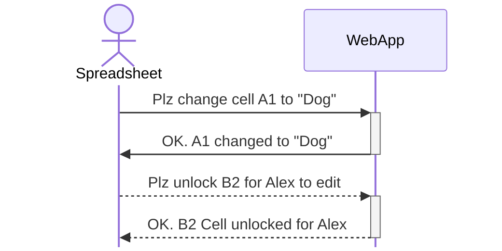
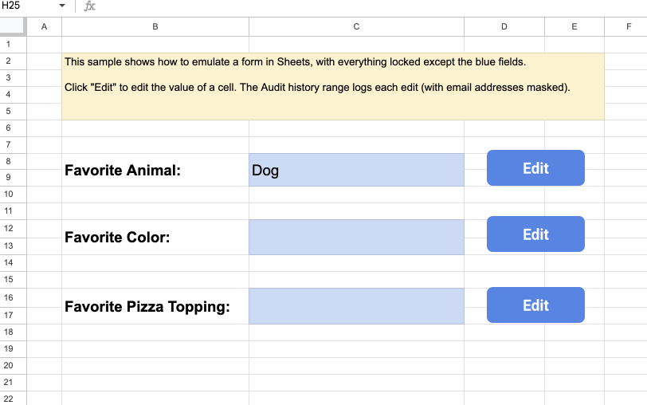
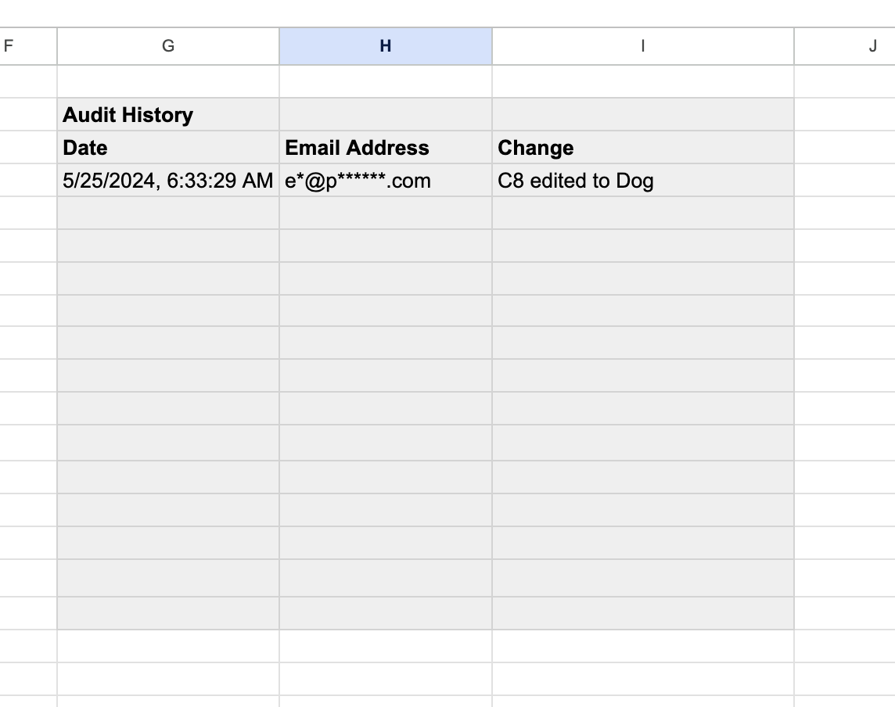
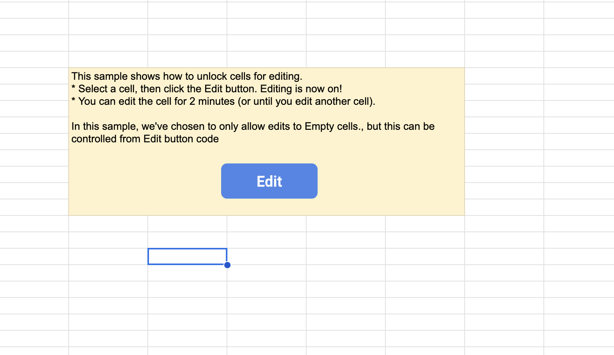

> [!CAUTION]
> This ReadMe and repo is still a work-in-process. Its not really ready to look at yet
>  
> You're welcome to browse, but I'm still experimenting with stuff

Lock-Unlock-Sheet
=================

> [!NOTE]
> This is my first GitHub open source repo! **Please :star: if you think it will be useful for people.**
>  

What this repo contains
---
This repo demonstrates a sample technique to programmatically lock/unlock cells in a Google Workspace Sheet.
 
The sample enables you to:
- Create locked forms in Google Sheets with editable form fields
- Capture audit history as people edit the form fields
- Unlock a single cell for editing, and lock the cell after they have finished
- Programatically lock/unlock a cell based on business rules, such as "a user can only edit empty cells" or "person x can override text in any cell" 

The sample is written entirely in Google Apps Script, distributed as open source (under the Apache2 license), you can use + change it as you wish. 
 
 
In this document you'll find a teaser video, try-before-you-buy sample, description of how-it-works, setup and user guide. 

### Here is the teaser video that shows what it does:
 

### Here is the try-before-you-buy sample:
<table>
  <tr>
    <td>TODO WAITING FOR OAUTH VERIFICATION</td>
    <td><-- Click this button to open the lock/unlock sample spreadsheet shown in the teaser video above. Your browser will need to be logged into a Google account</td>
  </tr>
</table>

How it works
---
> [!IMPORTANT]
> If you are the owner of the sheet, you **always** have edit rights to every cell.
>   To see it working, you'll need to use a Google account that has edit rights, but is **not the owner** of the Spreadsheet
> 
The Lock-Unlock-Sheet technique uses two objects running with different permissions:
* **Google Workspace Spreadsheet:** Users interact with a Spreadsheet. The Spreadsheet is shared with Edit permissions, but each Sheet within the Spreadsheet is locked to prevent editing. Because the Spreadsheet itself has edit permissions, users can click an Edit button, but they can't edit cells or change any content in the Sheet until it is unlocked
* **WebApp:** The WebApp runs with the Spreadsheet owner's permission (it has full rights to change any content in the sheet, or unlock cells for editing). When a user clicks an "Edit" button in the locked Spreadsheet, the spreadsheet requests the WebApp to to either set a cell's text (for forms) or unlock a cell for editing (for free editing). This diagram shows the flow for both cases:

The WebApp unlocks a cell for the user using a two layers of Spreadsheet protection. The lower protection layer is the sheet-lock. The webapp unlocks ranges within the sheet-lock, then adds an upper-layer range protection to the unlocked cell to ensure only the user requesting the edit is authorized to edit the cell. This means that when a user requests to edit a cell, it is unlocked only for them. The WebApp labels each unlocked range with the editor's email address, and unix timestamp for when the editing session expires. As future cells are unlocked for editing, the WebApp first cleans up expired editing sessions. 

Quickstart
---
In the steps below, you'll copy the code to your Google My Drive folder, and set up the Look-Unlock-Sheet sample
| Step | Description |
|:--:|---|
| | <-- Click button to copy Spreadsheet + code to your Google My Drive folder. After a couple minutes, "Copy of LockUnlock-Spreadsheet-v1" will open in the browser |
|  2 | **Deploy WebApp.** In Google Sheets, open Apps Script editor with menu item Extensions \| Apps Script. Click Deploy \| New Deployment button in the editor, and deploy as a WebApp, executing as "me" (this should already be pre-populated) |
|  3 | **Authorize Access.** As the WebApp is deployed, you'll be asked to authorize the scopes required. In this step, you're authorizing the WebApp permissions (not the Spreadsheet). Wait! before clicking through everything, make sure to copy the Web app URL, you'll need it real soon|
|  4 | **Update WebApp Url.** In Apps Script editor, navigate to the SheetCode.gs file. Update the first line that reads `var LIVE_URL = "TODO"` to use your WebApp Url. The line should look something like: `var LIVE_URL = "https://script.google.com/macros/s/####/exec"` |
|  5 | **Save Your Work.** In Apps Script editor, save the project. You're finished, we're ready to go!|

Test the Look-Unlock-Sheet Sample
=================================
> [!IMPORTANT]
> Because you are the owner of the sheet, you **always** have edit rights to every cell.
>   To see it working, use a colleague's account, someone who is **not the owner** of the Spreadsheet

Your "Copy of LockUnlock-Spreadsheet-v1" contains two sheets
Sheet1 demonstrates two techniques. 

Locked cells
---
The sheet behaves like a 'form', all cells are locked, the only cells that can be edited are those with a blue background. Click the edit button next to each cell and enter a value. In this screenshot, we've answered  "Dog" as our favorite animal. Because the cells in the sheet are locked, the Edit button invokes the web app to make the change, using the `set-cell-text` method.

Audit History
---
An advantage of using the Edit button instead of allowing a free-editing, is the sheet can capture an audit history of changes. After the user has made a change in the form, the spreadsheet invokes the web apps to update an audit history, scrolling a range of cells. This is done using the `set-range-text` method. Also note we've anonymized email adddresses using the custom function `getMaskedEmail(emailAddress)`

Free Editing
---
Sheet2 demonstrates unlocking a cell for free-editing. When a user positions focus on an empty cell, and clicks the Edit button, the cell is unlocked for them to edit for two minutes. 
This is done by invoking the `start-cell-edit` method. The cell remains locked for everyone except the target user (and the spreadsheet owner) for two minutes. Each time a method is called in the web app, the code performs a quick check to see if there are any expired editing sessions, and relocks the cell if the session is expired. This is how the expiry is implemented.

